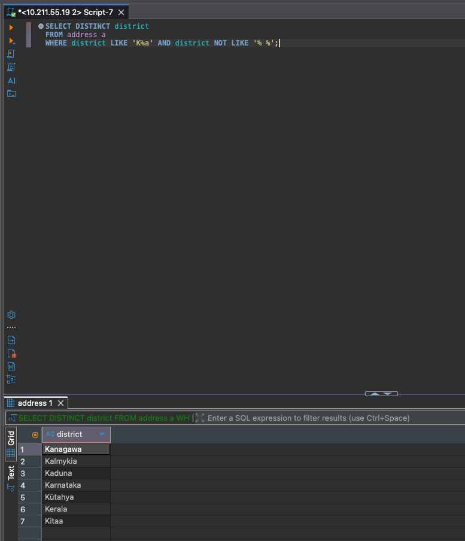
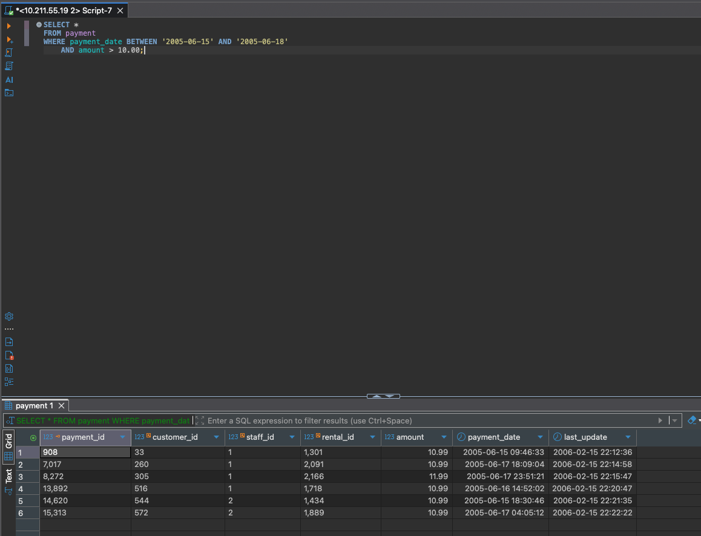
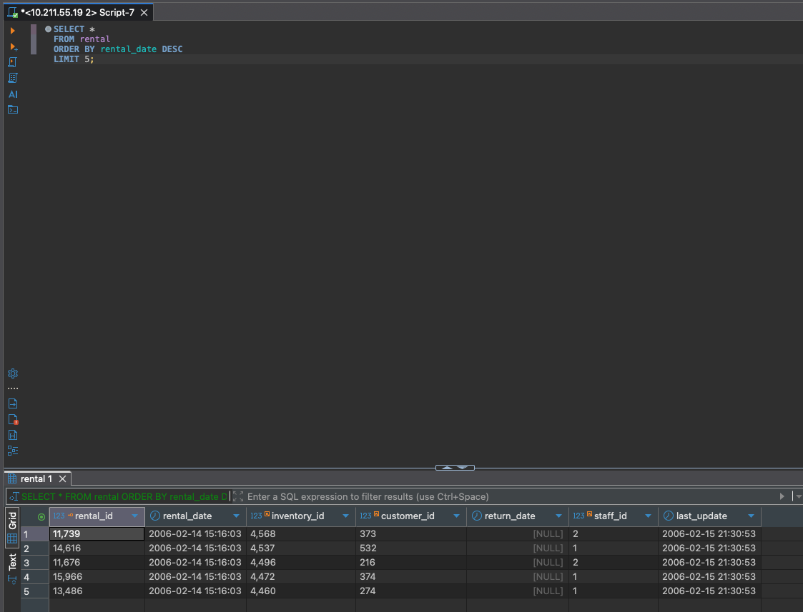
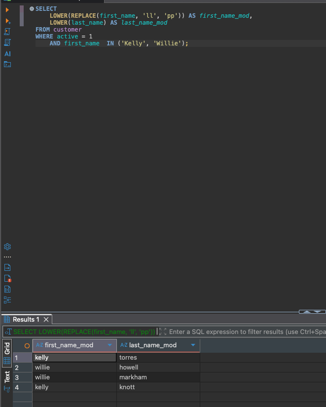

Задание 1 — Уникальные районы из таблицы address

Получите уникальные названия районов из таблицы с адресами, которые начинаются на “K”, заканчиваются на “a” и не содержат пробелов.

SQL-запрос

SELECT DISTINCT district
FROM address
WHERE district LIKE 'K%a'
  AND district NOT LIKE '% %';

**Скриншоты:**

⸻

Задание 2 — Фильтрация платежей

Получите из таблицы payment информацию по платежам, которые выполнялись
с 15 июня 2005 года по 18 июня 2005 года включительно и стоимость которых превышает 10.00.

SQL-запрос

SELECT *
FROM payment
WHERE payment_date BETWEEN '2005-06-15' AND '2005-06-18'
  AND amount > 10.00;

**Скриншоты:**

⸻

Задание 3 — Последние 5 аренд

Получите последние пять аренд фильмов.

SQL-запрос

SELECT *
FROM rental
ORDER BY rental_date DESC
LIMIT 5;

**Скриншоты:**

⸻

Задание 4 — Активные покупатели с изменёнными именами

Одним запросом получить активных покупателей, имена которых Kelly или Willie,
при этом вывести имена и фамилии в нижнем регистре, а в именах заменить ll на pp.

SQL-запрос

SELECT
  LOWER(REPLACE(first_name, 'll', 'pp')) AS first_name_mod,
  LOWER(last_name)                       AS last_name_mod
FROM customer
WHERE active = 1
  AND first_name IN ('Kelly', 'Willie');

**Скриншоты:**

